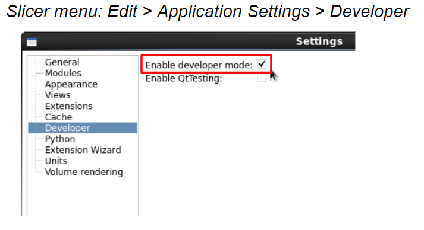
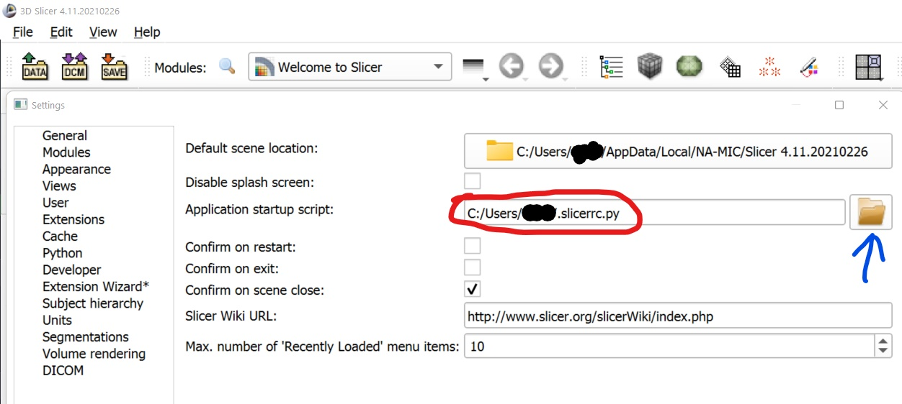

# mthesis-slicerAnnotationView
Repository to create a module for slicer which improves the choosing of landmarks between MR and US volumes

### Instructions for installing the module
1. On this webpage press the green button **'Code'** and choose **'Donwload ZIP'** from the dropdown menu
2. After the .zip file is downloaded unpack it somewhere (remember the location)
3. Open Slicer3D
4. Enable developer mode as shown in the screenshot below

5. Open the **'Extension Wizard'** module
6. From **'Extension Tools'** choose **'Select Extension'**
7. Choose the folder where the .zip file was unpacked

### Instructions for using the module

*A dummy dataset based on RESECT[1] can be found
[here](https://www.dropbox.com/sh/gabm0rqdh8kttj6/AADJfwfJnduJG4GJ92tygPufa?dl=0)*
1. Search for the module **'LandmarkingView'** and open it
2. (Ignore the 'Reload and Test' section)
3. In **'Inputs'** choose the three US volumes
4. Click on **'Create intersection'**
5. Wait for a few seconds for the intersection to be created
6. Now you can switch between the outline and the filled slice with:
   1. either the button marked in red in the screenshot below
   
   2. or in the Segmentations module with the buttons marked in red in the screenshot below
   

### Startup file
A file containing code that can be executed at each startup is included in
[/misc/startup_file.py](./misc/startup_file.py). To use it, paste the code into .slicerrc.py (replace the entire content
of .slicerrc.py with the content of [/misc/startup_file.py](./misc/startup_file.py). You can find .slicerrc.py by going
to Edit->Settings in Slicer3D. Then, the path to .slicerrc.py can be seen marked with red in the screenshot below (by
pressing on the button marked in blue the file will open automatically)

####Current startup functionality:
1. Link all views together
2. Shortcuts:
   1. **'d'** - change to the tool for placing markups (fiducials)
   2. **'s'** - switch between three us volumes forward (their names are hard-coded at the moment and need to be
   "US1 Pre-dura", "US2 Post-dura" and "US3 Resection Control")
   3. **'a'** - same functionality as 's,' only the switching occurs in the opposite direction