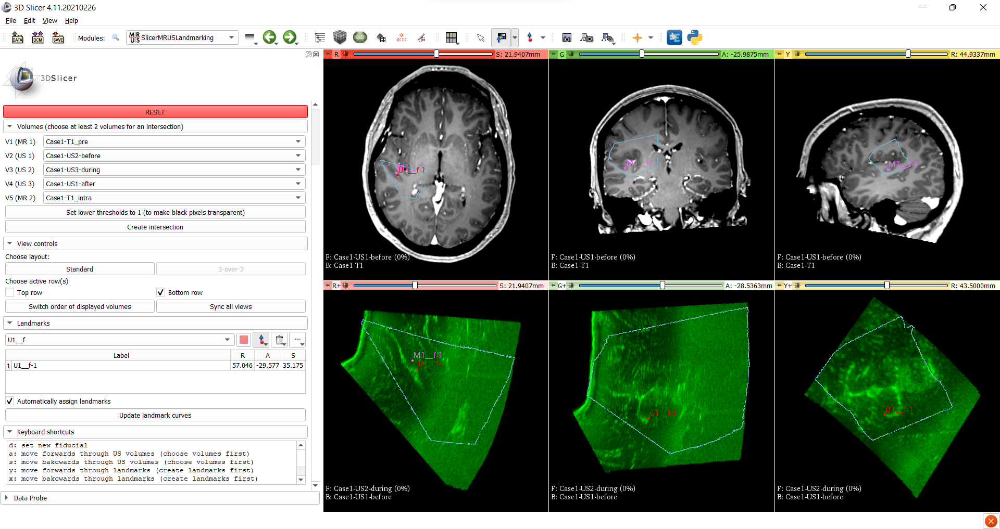

# SlicerMRUSLandmarking
SlicerMRUSLandmarking is a Slicer extension that provides a user interface focused on landmarking MR and US images.

### Instructions for using the module

*A dummy dataset based on RESECT[1] can be found
[here](https://www.dropbox.com/sh/gabm0rqdh8kttj6/AADJfwfJnduJG4GJ92tygPufa?dl=0)*
1. Search for the module **'MRUSLandmarking'** and open it

*Starting from the top:*

### 1. 'Common field of view'
   1. Choose the MR and US volumes
   2. Click on 'Set lower threshold to 1...' to set the lower threshld of the US volumes to 1
      1. thanks to this the black border surrounding the US volumes (which consists of 0s) will disappear in the overlay
   3. Click on 'Create intersection' - this will create the intersection of the three US images (intersection as the
   logical operator - the common field of view). At least two US volumes need to be chosen (US volumes are identified by
   the extension by containing any of the following strings in the filename: us1, us2, us3, us4, us5, us6)
   4. Wait for a few seconds for the intersection to be created and displayed

 

### 2. 'View controls'
   1. Choose between the standard view (Four-Up) and the 3-over-3 (Three over three) view
   2. When the 3-over-3 view is activated, choose which row(s) (top, bottom or both) should be active
      1. 'active' meaning which controls (e.g. switching between volumes) will act on them
   3. Click on 'Switch order of displayed volumes' if you want the order in which the volumes are displayed switched
   4. CLick on 'Sync all views' to sync the top and bottom row so that they show the same view

The idea behind having the 3-over-3 view and the linking/unlinking of the rows is that in the bottom row you can keep
e.g. a snapshot of one volume with a structure of interest while you search for the same structure in the top row.

 

### 3. 'Landmarks'
   1. The first part lets you choose a landmark list and the second lists all the landmarks in the chosen list (the same
   functionality as in the markups module)
   2. 'Automatically assign landmarks' - when this is checked landmarks are automatically assigned to lists according
   to which volume is displayed (only the top row is considered; if the foreground is >0 the landmark gets assigned to
   the foreground list, otherwise to the background list)
   3. 'Update landmark curves' - pressing this button updates curves that join corresponding landmarks (by default only
   visible in the 3D view). It assumes that the first landmark from one list corresponds to the first landmark of the
   other lists etc.

 

### 4. 'Keyboard shortcuts'
   1. **d** - set a new fiducial
   2. **a** - move forwards through the selected volumes (two volumes are displayed at all times, e.g. 2&3 and upon
   moving forward 3&4 are displayed, then 4&1 and finally 1&2)
      1. switching the order of displayed volumes would switch e.g. from 1&2 to 2&1
   3. **s** - move backwards through the selected volumes
   4. **y** - move forwards through the created landmarks (the landmark list hast to be named 'F')
   5. **x** - move backwards through the created landmars
   6. **1** - set foreground opacity to 0.0
   7. **2** - set foreground opacity to 0.5
   8. **3** - set foreground opacity to 1.0
   9. **q** - increase foreground opacity by 0.02
   10. **2** - decrease foreground opacity by 0.02

[1] Xiao, Yiming, et al. "RE troSpective Evaluation of Cerebral Tumors (RESECT): A clinical database of pre‐operative
MRI and intra‐operative ultrasound in low‐grade glioma surgeries." Medical physics 44.7 (2017): 3875-3882.