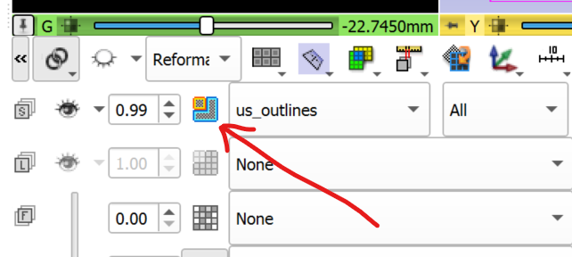
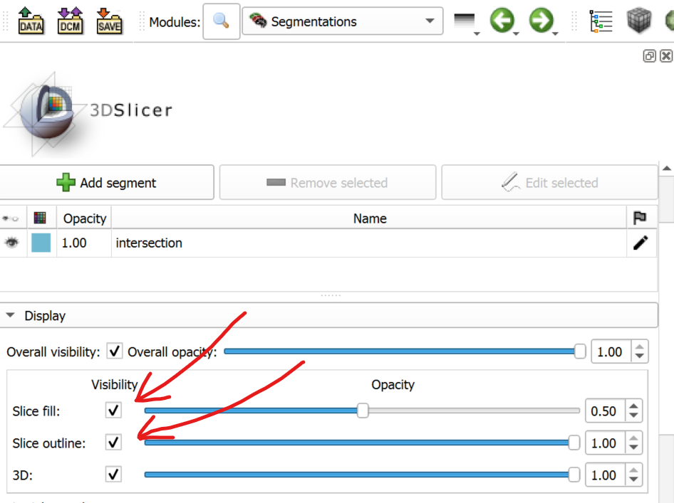

# mthesis-slicerAnnotationView
Repository to create a module for slicer which improves visualisation of data for annotating, especially landmarking

THE MODULE CAN CURRENTLY CREATE AN INTERSECTION OF THREE US VOLUMES

### Instructions for installing the module
1. Press the green button **'Code'** and choose **'Donwload ZIP'** from the dropdown menu
2. After the .zip file is downloaded unpack it somewhere (just remember the location)
3. Open Slicer3D and open the **'Extension Wizard'** module
4. From **'Extension Tools'** choose **'Select Extension'**
5. Choose the folder where the .zip file was unpacked

### Instructions for using the module
1. Search for the module **'LandmarkingView'** and open it
2. (Ignore the 'Reload and Test' section)
3. In **'Inputs'** choose the three US volumes
4. Click on **'Create intersection**
5. Wait for a few seconds for the intersection to be created
6. Now you can switch between the outline and the filled slice with:
   1. either the button marked in red in the screenshot below
   
   2. or in the Segmentations module with the buttons marked in red in the screenshot below
   
